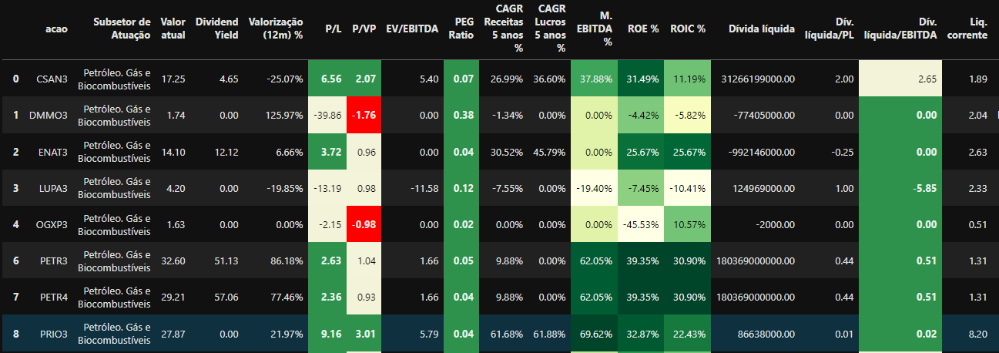

<h1 style='color:red' align='center'> Análise de Ações com Python <i style='color:black'>- Parte 1 </i> </h1>

 Este é um repositório onde explico e demonstro através do python a maneira com a qual realizo a filtragem inicial das ações que pretendo estudar e comprar. 
 

 <i> <b> Portanto gostaria de frizar que esta é a maneira que eu utilizo, independente de ser a melhor ou a pior, mas a que eu prefiro utilizar para minhas análises. </b> </i> 
 

<blockquote> 
 Para acessar ao  Notebook e visualizar todo este processo, acesse <a href='https://github.com/zThanael/Analise-de-Acoes-com-Python---Parte-1/blob/main/Acoes.ipynb'> <b style='color:red'> <u> clicando aqui </u> </b> </a> 

</blockquote>

<h2 style='color:blue' align='left'> Etapas que serão explicadas ao decorrer do notebook. </h2>

 Lembrando que para acessar o notebook e visualizar a construção do projeto, é necessário acessar o arquivo <b> ações.ipynb </b> ou <a href='https://github.com/zThanael/Analise-de-Acoes-com-Python---Parte-1/blob/main/Acoes.ipynb'> <b style='color:red'> <u> clicando aqui </u> </b> </a> 

 

<h3> <li> Web Scraping - Obtenção dos dados das ações </li> </h3>

 Este é o processo na qual realizaremos a raspagem de informações do site <a href='https://statusinvest.com.br/'> <b> status invest </b> </a>, para obter os indicadores e as informações de cada ação. 

 Caso ficou curioso e queria saber o que é <b> Web Scraping</b>, acesse <a href='https://github.com/zThanael/Analise-de-Acoes-com-Python---Parte-1/blob/main/Acoes.ipynb'> <b style='color:red'> <u> este repositório.</u> </b> </a> 

 

<h3> <li> Manipulação dos dados </li> </h3>

 Este processo consiste em ajustar e tratar os dados obtidos através do Web Scraping, portanto precisamos ajustar os tipos de dados, filtrar as colunas entre outras informações para que obtenhamos um DataFrame limpo e organizado. 

 

<h3> <li> Visualização dos dados </li> </h3>

 Este é o processo onde construiremos uma visualização do nosso DataFrame, podendo identificar seus indicadores e se o indicador possui um valor bom ou ruim com base na sua cor.

 <b> <i > Veja um spoiler do que foi construído </i> </b> 

 

 Caso ficou curioso e queria saber mais sobre essa <b> estilização de DataFrame</b>, acesse <a href='https://forum.casadodesenvolvedor.com.br/topic/44878-estiliza%C3%A7%C3%A3o-de-um-dataframe/#comment-46529'> <b style='color:red'> <u> este fórum.</u> </b> </a> 

<h2 style='color:blue' align='left'> Espero que este contéudo tenha lhe ajudado de alguma forma! </h2>

 Sinta-se a vontade para realizar sugestões ou comentário sobre o mesmo! 

